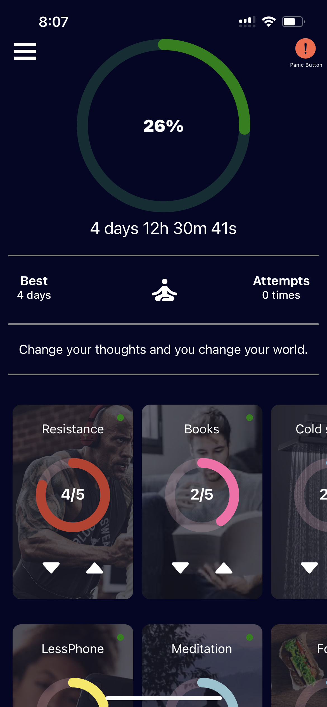
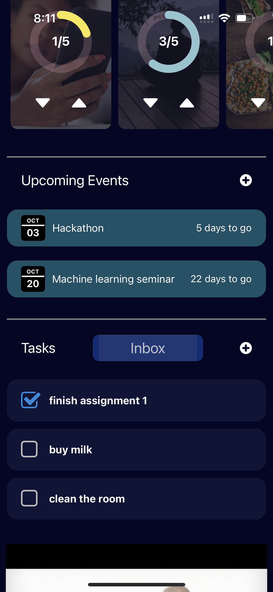
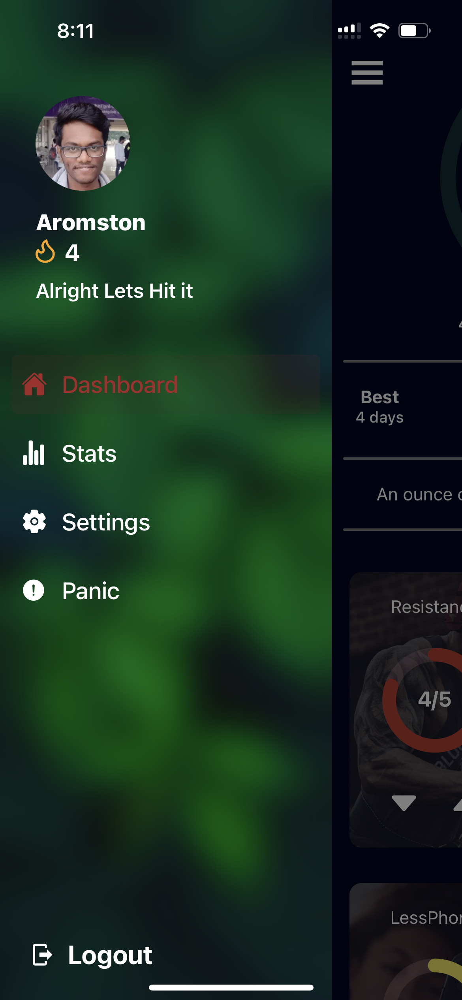
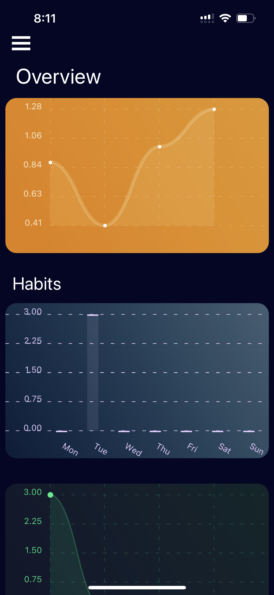
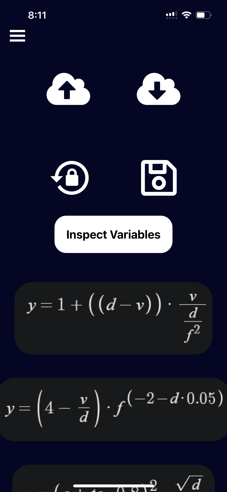

## This is a habit builder application which motivates the user to keep maintaining the streek of their habits by rewarding them every day

- the app displays motivational quotes every day and also selects 2 random motivational youtube videos every day
- the app runs on an algorithm which generates a score based on the user's streak and other activities every day

### Technology used

- React Native
- Context API
- Google Firebase
- Youtube API

## Screen Shots of the app

# Home page

# Tasks and Events

# Motivational Videos

# Side Naviation Bar

# Statistics of the streak

# Settings Page

